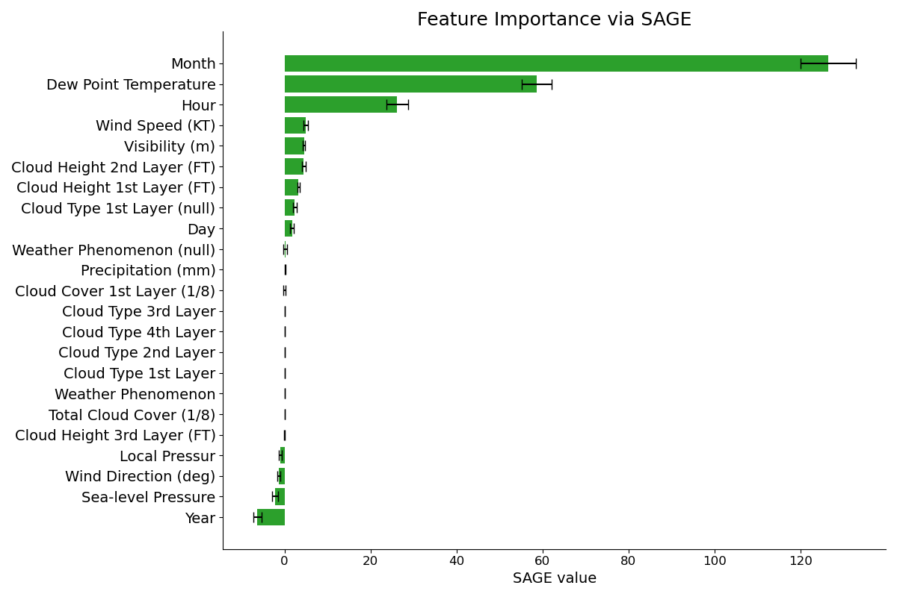

# SAGE-Guided-CatBoost


## 📌 Installation

```bash
conda create -n sageboost python=3.8
conda activate sageboost

git clone https://github.com/iminolee/SAGE-Guided-CatBoost.git
cd SAGE-Guided-CatBoost
pip install -r requirements.txt
```

## 🚀 Quick Usage

```bash
cd SAGE-Guided-CatBoost
python catboost_train.py
```
Choose the model by modifying the *model_num* parameter in the script:
* 0: Linear Regression <br>
* 1: CatBoost <br>
* 2: LightGBM <br>
* 3: XGBoost <br>
* 4: Random Forest <br>

## 🔍 Plotting SAGE value

```bash
cd SAGE-Guided-CatBoost
python sage_features.py
```

The result will look like this:

<div align="center">

</div>

## ✨ Acknowledgement

Covert, Ian, Scott M. Lundberg, and Su-In Lee. "Understanding global feature contributions with additive importance measures." NeurIPS 2020. (https://github.com/iancovert/sage)
